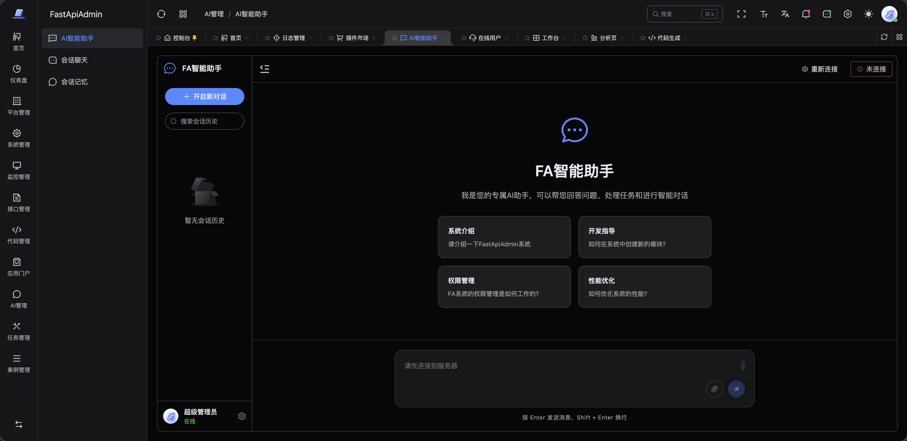

<div align="center">
     <p align="center">
          
     </p>
     <h1>FastApiAdmin <sup style="background-color: #28a745; color: white; padding: 2px 6px; border-radius: 3px; font-size: 0.4em; vertical-align: super; margin-left: 5px;">v3.0.0</sup></h1>
     <h3>🚀 Exceptional Code Quality, Production-Ready Admin Dashboard in 5 Minutes</h3>
     <p>Full-stack rapid development platform powered by <b>FastAPI + Vue3 + TypeScript</b>. Web, H5, and Mini Program — all in one project.</p>
     <p align="center">
          <a href="https://gitee.com/fastapiadmin/FastapiAdmin.git" target="_blank">
               
          </a>
          <a href="https://github.com/fastapiadmin/FastapiAdmin.git" target="_blank">
               
          </a>
          <a href="https://github.com/fastapiadmin/FastapiAdmin/forks" target="_blank">
               
          </a>
          <br>
          <a href="https://gitee.com/fastapiadmin/FastapiAdmin/blob/master/LICENSE" target="_blank">
               
          </a>
          
          
          
          
     </p>

English | [简体中文](./README.md)

</div>

## 💡 Why FastapiAdmin?

| You Need | FastapiAdmin | Django Admin | Frontend-Only |
|----------|:-----------:|:-----------:|:-------------:|
| 🎯 **Ready-to-use** admin system | ✅ | ⚠️ Limited | ❌ UI only |
| ⚡ **FastAPI async** high-performance backend | ✅ | ❌ Sync-first | ❌ No backend |
| 🔐 **RBAC** menu/button/data level permissions | ✅ | ❌ Basic | ❌ |
| 🤖 **Code generator** (table → full CRUD) | ✅ | ❌ | ❌ |
| 📱 **Mobile** (H5 + Mini Program) included | ✅ | ❌ | ❌ |
| 🐳 **Docker** one-click deploy (Nginx + SSL) | ✅ | ❌ | ❌ |

> 👉 Full comparison: [Why FastapiAdmin?](https://service.fastapiadmin.com/en/guide/why)

## 🍪 Live Demo

| | URL | Account |
|---|-----|---------|
| 💻 Web | [service.fastapiadmin.com/web](https://service.fastapiadmin.com/web) | `admin` / `123456` |
| 📱 Mobile | [service.fastapiadmin.com/app](https://service.fastapiadmin.com/app) | `admin` / `123456` |
| 📖 Official Docs | [service.fastapiadmin.com](https://service.fastapiadmin.com) | No login |

## 🚀 5-Minute Quick Start

```bash
# 1. Clone
git clone https://github.com/fastapiadmin/FastapiAdmin.git

# 2. Configure environments
cp backend/env/.env.dev.example backend/env/.env.dev
cp frontend/web/.env.development.example frontend/web/.env.development

# 3. Start backend (auto-creates tables + seed data on first run)
cd backend && uv sync && uv run main.py run --env=dev

# 4. Start frontend
cd ../frontend/web && pnpm install && pnpm run dev

# ✅ Open http://127.0.0.1:5173, login with admin/123456
```

| Requirements | |
|-------------|------|
| Python ≥ 3.12 | Node.js ≥ 20 + pnpm |
| MySQL 8.0+ / PostgreSQL 14+ | Redis 6.x / 7.x |

## 📦 Structure

```
FastapiAdmin/            # Monorepo full-stack project
├─ backend/              # FastAPI backend (Pydantic 2.0 + SQLAlchemy + Alembic)
├─ frontend/
│   ├── web/             # Vue3 Web (Element Plus + TypeScript)
│   ├── app/             # UniApp Mobile (H5 + Mini Program + App)
│   └── docs/            # VitePress documentation
├─ docker/               # Docker Compose deploy (Nginx + SSL)
├─ deploy.sh             # One-click deploy script
└─ LICENSE               # MIT
```

## 📌 Built-in Features

### Core Modules (always enabled, cannot be removed)

| Module | Capabilities |
|--------|-------------|
| 📊 Dashboard | Workbench, Analytics |
| ⚙️ System Management | Users, Roles, Menus, Departments, Positions, Dicts, Config, Notices, Tickets, Versions |
| 👀 Monitoring | Online users, Server monitoring, Cache monitoring |
| 📝 Logs | Operation audit |
| 🧰 Dev Tools | API Docs |

### Extension Modules (enabled by default, trim via `ENABLED_MODULES`)

| Module | Capabilities | Toggle |
|--------|-------------|--------|
| 🧩 Task Management | Scheduled tasks + visual workflow orchestration (built-in business nodes) | `task` |
| 🔧 Code Generator | Table → full frontend/backend code | `generator` |
| 📁 Storage | Unified file / object storage (SFTP / S3 / OSS / COS / OBS) | `storage` |
| 🤖 AI Chat | Agno-powered agent conversations | `ai` |
| 💬 Internal Chat | Text-only private / group chat between users (WebSocket real-time push + unread badge) | `chat` |

## 🔧 Module Toggling

Extension modules can be enabled/disabled on demand via `ENABLED_MODULES` in `backend/app/config/setting.py` — **just remove an item from the list; no code or menu deletion needed**. The corresponding REST endpoints, WebSocket endpoints and initialization logic will not be loaded automatically:

```python
# e.g. Disable internal chat and AI assistant, keep the rest
ENABLED_MODULES = ["generator", "task", "storage"]
```

## 🚦 Deployment Notes

- **Chat scope**: Internal chat is positioned as **lightweight internal communication** — text-only messages. **No file transfer, recall, read receipts, or multi-device sync (IM features)**. For strong IM needs, integrate mature products such as WeCom / DingTalk / Feishu. It can be disabled anytime by removing `chat` from `ENABLED_MODULES`.
- **Single-instance deployment**: Real-time features (internal chat WebSocket, scheduled task scheduler) rely on in-memory connections and local scheduling within a single instance — please deploy as a **single instance**. For horizontal scaling, integrate Redis Pub/Sub or a message queue yourself.
- **Key security**: Configure all third-party keys (AI, cloud storage, etc.) in the `backend/env/.env.*` environment variables. **Never commit them to the repository or store them in the database**.
- **Database migrations**: Manage schema changes with Alembic migrations in production (`uv run alembic upgrade head`); `create_all` is only a fallback for first-time initialization.

## 🔧 Screenshots

| Login | Dashboard | Code Generator | AI Assistant |
| ----- | --------- | -------------- | ------------ |
|  |  |  |  |

## 📖 Documentation

- 🌐 [Official Docs](https://service.fastapiadmin.com) — Full guides, architecture, custom development
- 📁 Sub-project READMEs: [backend](backend/README.md) · [web](frontend/web/README.md) · [mobile](frontend/app/README.md) · [Docker](docker/README.md)

## 🤝 Contributing

Issues and PRs are welcome! See [Contributing Guide](https://service.fastapiadmin.com/en/about/contributing).

## 👥 Community

<p>


</p>

## 👥 Contributors

> Thank you to all contributors who have contributed code to FastapiAdmin.

<a href="https://github.com/fastapiadmin/FastapiAdmin/graphs/contributors">
  
</a>

## 🙏 Acknowledgments

> If you find this project useful, please give it a ⭐️ Star!

- Backend: [FastAPI](https://fastapi.tiangolo.com/) · [Pydantic](https://docs.pydantic.dev/) · [SQLAlchemy](https://www.sqlalchemy.org/) · [APScheduler](https://github.com/agronholm/apscheduler)
- Frontend: [Vue3](https://vuejs.org/) · [TypeScript](https://www.typescriptlang.org/) · [Vite](https://vitejs.dev/) · [Element Plus](https://element-plus.org/)
- Mobile: [UniApp](https://uniapp.dcloud.net.cn/) · [Wot Design Uni](https://wot-ui.cn/)
- AI: [Agno](https://github.com/agno-agi/agno)
